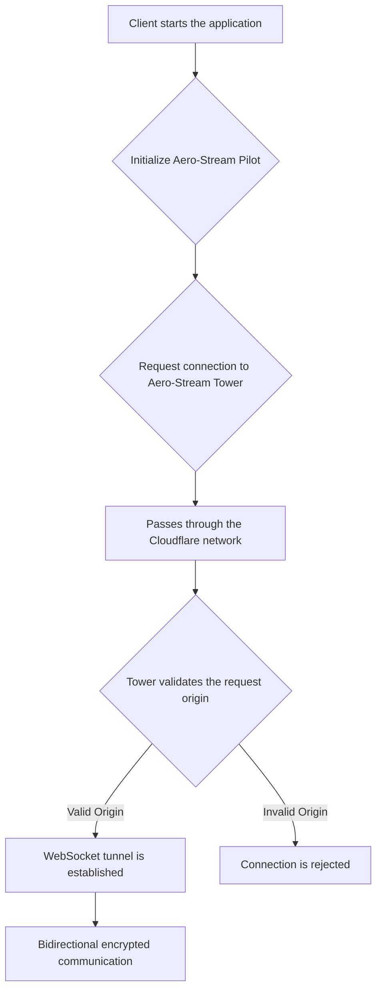

# Use Cases and Flows

## Secure Connection Establishment Flow

This flow describes the main use case where a client establishes a secure connection with the server.

### Flow Description

1.  **Start:** The user opens the client application containing the `pilot` component.
2.  **Initialization:** The `pilot` initializes and prepares for the connection.
3.  **Request:** The `pilot` sends an `Upgrade` request to WebSocket (via WSS) to the `tower`'s endpoint.
4.  **Validation:** The `tower`, running on a Cloudflare Worker, intercepts the request. A middleware validates that the `Origin` header matches a predefined whitelist of domains.
5.  **Establishment:** If validation is successful, the Worker responds with an `HTTP 101 Switching Protocols`, and the WebSocket tunnel is established.
6.  **Rejection:** If validation fails, an `HTTP 403 Forbidden` response is returned, and the connection is not established.
7.  **Communication:** Once connected, the `pilot` and `tower` can exchange data securely and bidirectionally.
